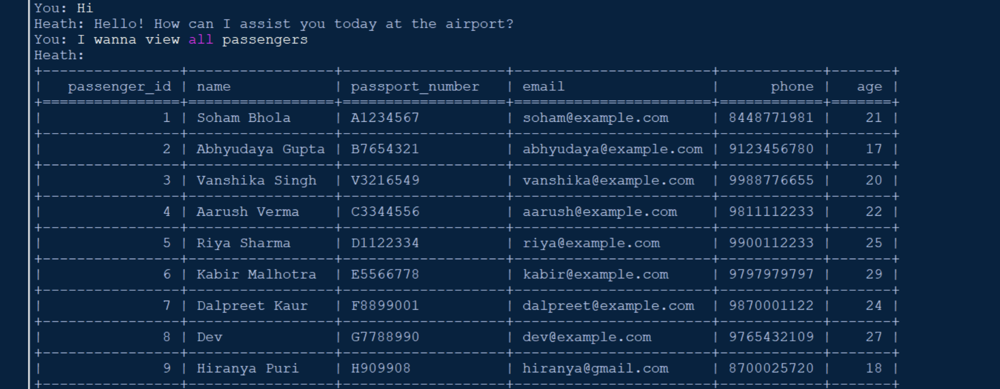
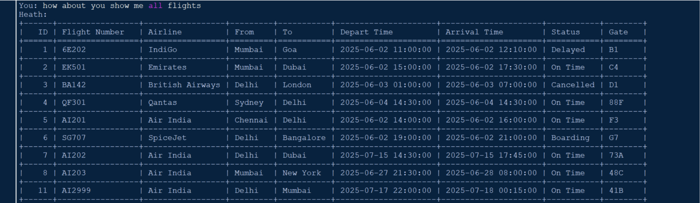
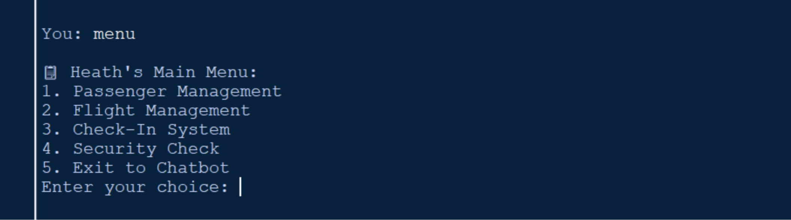
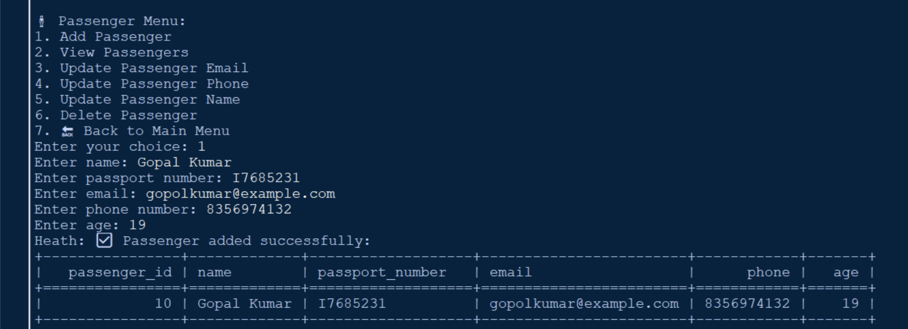
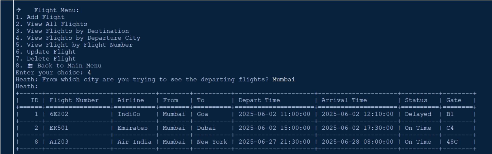
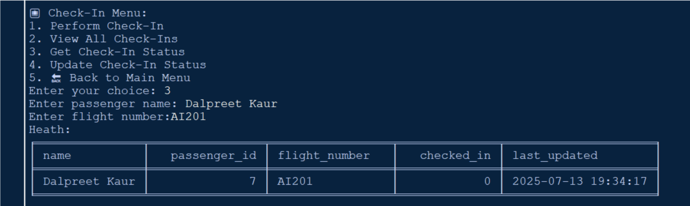
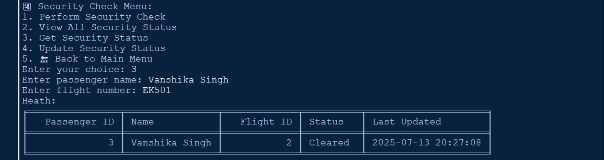

# ✈️ Airport Management System with Chatbot


An Airport Management System built using **Python** and **MySQL**, featuring a smart **NLP-based chatbot** that allows users to manage airport operations through natural language commands and a menu interface.

---

## 🚀 Overview

This project simulates real-world airport workflows such as **passenger management, flight handling, check-ins, and security verification** — all accessible via a conversational chatbot or a structured menu interface.

At the core of the system is an intelligent assistant named **Heath**, which understands user input using NLP and executes database operations seamlessly.

---

## 🔥 Key Features

* 🤖 **Chatbot (Heath)**

  * Understands natural language commands
  * Executes backend operations dynamically

* 🧍 **Passenger Management**

  * Add, view, update, and delete passengers

* ✈️ **Flight Management**

  * Add, update, delete, and search flights

* 🎫 **Check-In System**

  * Perform and track passenger check-ins

* 🔐 **Security Checks**

  * Manage passenger clearance status

* 📋 **Menu System**

  * Alternative structured interface

---

## 🛠️ Tech Stack

* **Language:** Python 3.13.11
* **Database:** MySQL
* **Libraries:**

  * `pymysql`
  * `spacy`
  * `tabulate`
  * `csv`

---

## 🧠 System Architecture

User Input → NLP Engine (`nlp_brain.py`) → Core Logic (`core_logic.py`) → MySQL Database → Output

---

## 📂 Project Structure

```
Airport-Management-System/
│
├── modules/
│   ├── crud_passengers.py
│   ├── crud_flights.py
│   ├── checkin.py
│   └── security_checks.py
│
├── nlp_brain.py
├── core_logic.py
├── db_config.py
├── menu_system.py
├── Main.py
├── insert_mock_data.py
├── airport_db.sql
├── airports.csv
├── requirements.txt
├── README.md
└── .gitignore
```

---

## ⚙️ Setup & Installation

### 1️⃣ Clone the Repository

```bash
git clone https://github.com/your-username/airport_management_system_chatbot.git
cd airport_management_system_chatbot
```

### 2️⃣ Install Dependencies

```bash
pip install -r requirements.txt
python -m spacy download en_core_web_sm
```

### 3️⃣ Setup MySQL Database

```sql
CREATE DATABASE airport_management_system;
USE airport_management_system;
```

Then import schema:

```bash
SOURCE airport_db.sql;
```

### 4️⃣ Configure Database

Update your MySQL credentials in `db_config.py`

---

## ▶️ Running the Project

### Chatbot Mode

```bash
python Main.py
```

### Example Commands

* "Add a new passenger"
* "Show all flights"
* "Check-in John for flight AI203"
* "Update passenger 1 email to [test@gmail.com](mailto:test@gmail.com)"

### Menu Mode

Type:

```
menu
```

---

## 📸 Demo

### 🤖 NLP Chatbot Interaction



### 🖥️ Main Menu


### 📋 Passenger Management


### ✈️ Flight Management


### 🎫 Check-In System


### 🔐 Security Check


---

## 💡 Future Enhancements

* GUI using Tkinter or Flask
* Real-time flight API integration
* User authentication system
* Multilingual NLP support
* Cloud deployment

---

## ⭐ Why This Project Stands Out

* Combines **AI + Database + System Design**
* Real-world airport workflow simulation
* Clean modular architecture
* Dual interface (chatbot + menu)

---

## 👤 Author

**Soham Bhola**

---

⭐ If you like this project, consider giving it a star!
